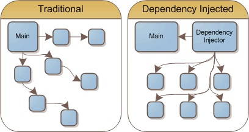

# Web Dev Test: Highscore Service
The goal of this test is to implement a basic web service to track highscores of game clients.

The test's requirements are as follows:

- Implement a basic API server that offers endpoints for managing game highscores of several game clients.
    - Endpoint for registering the new highscore of a user.
    - Endpoint for removing all highscores of a user.
    - The highscores should be persisted and managed in a database.
- Implement a very simple SPA (Single Page Application) for listing the current scoreboard.
    - The SPA should be served by accessing a certain endpoint of the API server.
    - The SPA should show a simple list of all highscores and who achieved them (in-order, top-to-bottom score). Limit the scoreboard to the top 100 entries.
    - There should be an input field to filter for all highscores of users that match the input.
- Provide a specification of your web API.
- Provide a short (but sufficient) explanation on how to set up your project for local testing and explain how we can easily test your API.
- Provide a short explanation on how you would approach managing and deploying this service to a cloud environment.

# Resume:
I did not begin to take out parts of the program into separate microservice for DataLayer, ApiController etc. to not waste time deploying containers.

Main idea of microsevies 
- components are weakly associated with each other. 
And this is a main problem. 
We can use docker swarm or kubernetes to solve a lot of problem.  

In my project, main idea, that we have services, who communicate with each others with infrastructure service:
- it has a set of interfaces. Other services implement these interfaces。
So, if service need something from another service, he can easy take his interface from infrastructure service and get necessary data without knowing anything about the implementation.
In this case, we can use Dependency Injection pattern. 

- About specification of web API. I turn on The Development ENVIRONMENT on docker settings, 
so you can use swagger from container directly. 

- Frontend:
    - Asp.Net Core 7.0 
    - Razor pages (I didint have any experience with this technology. But I really wanna try it, so I spent the most time on this)    

- Backend:
    - Asp.Net Core 7.0 
    - Entity Framework Core 7.0
    - Unity Container

- What next? 
    - Authorization service. 
    - The Unit of Work pattern. 
    - Error handler
    - Interceptors 
    - Logging
    - UnitTest
    - etc.

# HOW TO SET UP
I used docker compouse, so deploy is easy and simple, make sure that port is not busy. 

1. Install <a href="https://www.docker.com/products/docker-desktop/">docker dekstop</a>
2. Go to the project root folder, where docker-compose file 
3. Use command to build images
>docker-compose build
4. Use command to use compose for start backend/frontend side
>docker-compose up

About specification of web API. I turn on The Development ENVIRONMENT on docker settings, so you can use swagger from container directly.
- Port for frontend: <a href="http://localhost:5902">5902</a>
- Port for backend: <a href="http://localhost:5000">5000</a>
